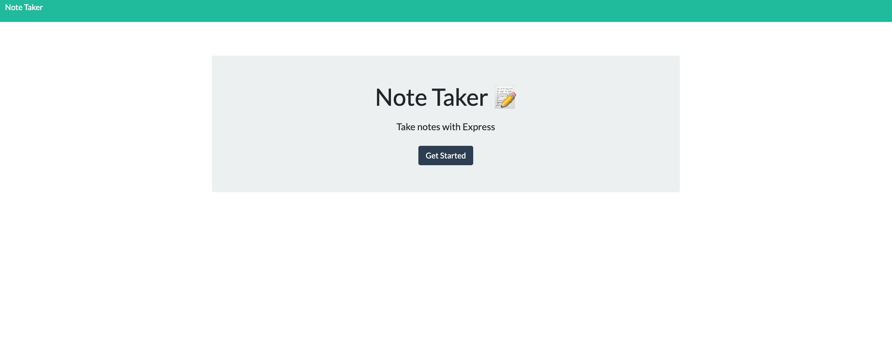
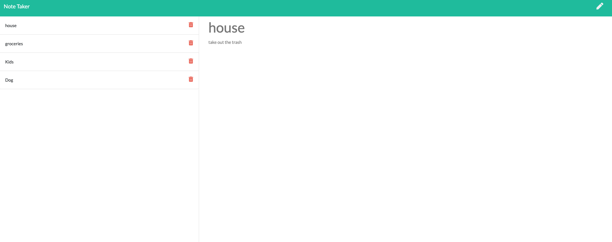

# Note-Taker-Application

  
  

---

## Table of Contents
- [About the Project](#About-the-Project)
- [Getting Started](#Getting-Started)
- [Installation](#Installation)
- [Contributing](#Contributing)
- [Testing](#Testing)
- [License](#License) 

## About the Project
This app allows the user to write, save, and delete notes. The application always returns to the users latests saved notes. 

  

## Getting Started  
To try the app, please visit:  
  
https://quiet-island-16772.herokuapp.com/
  

### Installation  
No installation required.

## Testing
No testing required.
  

## Contributing
To contribute to this project contact Sam Rodriguez.  
Github Repository URL: https://github.com/samrod777/Note-Taker-Application  

## License
This application is covered under the MIT license.  

